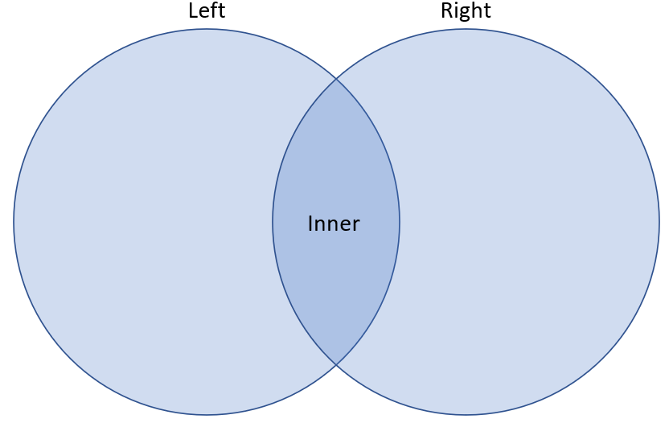

<h1>Joining data in Pandas</h1>

 

 

    

 

<h3>Type of joins with <code>.merge()</code></h3>

Combining data points across multiple sources is made possible using <code>merge</code>. With a common value, such as a <code>unique_id</code>, relationships can be formed between tables allowing additional data points to be retrieved. The nature of the join (<code>inner/left/right/outer</code>) will impact how data is pulled from one table to another, i.e. what is included and excluded. <code>Semi-</code> and <code>anti-</code> joins are explored are more complex layers of filtering against other tables. Adjoining tables can also have varying relationships, such as a one-to-one relationship where adjoining tables contain one observation per id, although many others exist. These relationships can be validated to anticipate how results will be impacted.

    

 

<h3>Fuzzy joins with <code>.merge_ordered()</code> and <code>.merge_asof()</code></h3>

Joining time series data can be problematic due to how the data is collected, e.g. apps recording timestamps, events triggering with milisecond differences, or truncated dates not aligning with precise dates. Advanced joining methods help circumvent these issues, allowing joins to take place on close time series fields or to interpolate, or fill in, <code>NaN</code> values with most recent data.

    

 

<h3>Filtering with <code>.query()</code></h3>

The <code>query</code> method allows DataFrame to be filtered according to the query expression. This is given as a string parameter. The results returned will be the observations where the expression is True. Basic logic operators are applicable, e.g. <code>'> / >= / < / <= / =='</code>, and can be layered with <code>'and / or'</code> criteria.

    

 

<h3>Unpivoting with <code>.melt()</code></h3>

Pandas <code>melt</code> function is used to change the DataFrame format from long to tall. This creates a specific format of the DataFrame object where one or more columns work as identifiers and the remaining columns are transformed to two new fields: <code>variable</code> and <code>value</code>.

    

